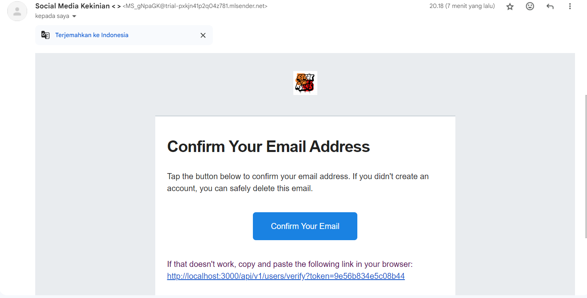

# Express JS WITH SUPER POWER

## Sample email verification

---
---
---

## Branch Main
Only used Javascript

## Branch Typescript
Full used typescript

### features :

> Node JS (Standart) :D it's only js not typescript -->>> main branch
>
> Routing version (so you can deploy any version of your api)
>
> Email Sender for verify user and forgot password user
>
> Realtime data used SocketIO for frontend
>
> MySQL Database
>
> JWT Token for auth (header or cookie mmm)
>
> Docker (for make us happy :P)

---
